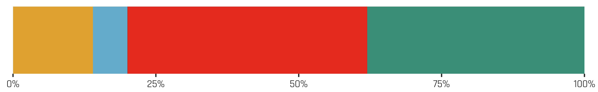
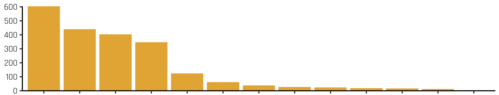

```{r setup, include=FALSE}
knitr::opts_chunk$set(echo = TRUE)
```

## Install xaringanExtra {-}


```{r install, eval=FALSE, include=TRUE}
# install.packages("remotes")
remotes::install_github("gadenbuie/xaringanExtra")
```

## Import the panelset css {-}

Add the following chunk **once** into the bookdown project e.g. index.Rmd.

````markdown
`r ''````{r panel-setup, include = FALSE}
xaringanExtra::use_panelset()
xaringanExtra::style_panelset(font_family = "inherit")
```
````

```{r panel-setup2, include = FALSE}
library(xaringanExtra)
xaringanExtra::use_panelset()
xaringanExtra::style_panelset(font_family = "inherit")
```

## Creating a panelset {-}

Apply the `{.panelset}` class to a parent heading to convert all child headings into tabs

````markdown

### Panelset {.panelset}

#### Panel 1 

Lorem ipsum dolor sit amet, consectetur adipiscing elit. Praesent pharetra commodo sem. Interdum et malesuada fames ac ante ipsum primis in faucibus. 

`r ''````{r img1, echo = FALSE, out.width='100%', fig.cap = "Mauris id lectus ut ex tempor ornare."}



```

Proin rhoncus lacus eu molestie faucibus. Cras sagittis lectus at ligula maximus, nec venenatis orci vulputate. Phasellus consequat dolor nec ullamcorper consequat. 

#### Panel 2 

Aliquam mi tellus, rutrum auctor odio et, dignissim consequat tellus. Nullam commodo egestas laoreet. In scelerisque, purus et venenatis venenatis, quam tellus maximus elit, id ultrices nibh diam vitae eros. Nunc tincidunt dictum vulputate. Nam mi dolor, dapibus a gravida in, faucibus sit amet sem. Aenean vel eleifend lectus.

`r ''````{r img2, echo = FALSE, out.width='100%', class = "text-image", fig.cap = "Cras a massa vel sapien pretium feugiat pulvinar at magna."}



```

#### Panel 3 

Nulla facilisi. Nulla facilisi. Donec eleifend dictum imperdiet. Integer lacus nunc, rutrum dapibus purus quis, sollicitudin bibendum mauris. Pellentesque a velit interdum justo cursus consectetur. Proin lacinia finibus ante a suscipit. Phasellus ac risus eget ante blandit pulvinar sed in massa.

##### Subheading 

Mauris porta pulvinar gravida. Maecenas at lobortis lacus. Nulla sed dictum metus, ac consequat urna. Aliquam ultrices tempor blandit. Nunc eros felis, varius vel lacinia laoreet, mattis et orci. Maecenas facilisis sit amet ipsum et porttitor.

`r ''````{r img3, echo = FALSE, out.width='100%', class = "text-image", fig.cap = "Pellentesque consectetur lacus nec eros gravida, sed tempor eros pulvinar."}


```

````

to create:

### Panelset { - .panelset}

#### Panel 1 {-}

Lorem ipsum dolor sit amet, consectetur adipiscing elit. Praesent pharetra commodo sem. Interdum et malesuada fames ac ante ipsum primis in faucibus. 

```{r img1, echo = FALSE, out.width='100%', fig.cap = "Mauris id lectus ut ex tempor ornare."}


```

Proin rhoncus lacus eu molestie faucibus. Cras sagittis lectus at ligula maximus, nec venenatis orci vulputate. Phasellus consequat dolor nec ullamcorper consequat. 

#### Panel 2 {-}

Aliquam mi tellus, rutrum auctor odio et, dignissim consequat tellus. Nullam commodo egestas laoreet. In scelerisque, purus et venenatis venenatis, quam tellus maximus elit, id ultrices nibh diam vitae eros. Nunc tincidunt dictum vulputate. Nam mi dolor, dapibus a gravida in, faucibus sit amet sem. Aenean vel eleifend lectus.

```{r img2, echo = FALSE, out.width='100%', class = "text-image", fig.cap = "Cras a massa vel sapien pretium feugiat pulvinar at magna."}


```

#### Panel 3 {-}

Nulla facilisi. Nulla facilisi. Donec eleifend dictum imperdiet. Integer lacus nunc, rutrum dapibus purus quis, sollicitudin bibendum mauris. Pellentesque a velit interdum justo cursus consectetur. Proin lacinia finibus ante a suscipit. Phasellus ac risus eget ante blandit pulvinar sed in massa.

##### Subheading {-}

Mauris porta pulvinar gravida. Maecenas at lobortis lacus. Nulla sed dictum metus, ac consequat urna. Aliquam ultrices tempor blandit. Nunc eros felis, varius vel lacinia laoreet, mattis et orci. Maecenas facilisis sit amet ipsum et porttitor.

```{r img3, echo = FALSE, out.width='100%', class = "text-image", fig.cap = "Pellentesque consectetur lacus nec eros gravida, sed tempor eros pulvinar."}


```

### Sideways panelset { - .panelset .sideways}

To create a sideways panelset apply the `{.panelset .sidways}` classes instead of `{.panelset}`.

#### Panel 1 {-}

Lorem ipsum dolor sit amet, consectetur adipiscing elit. Praesent pharetra commodo sem. Interdum et malesuada fames ac ante ipsum primis in faucibus. 

```{r img1a, echo = FALSE, out.width='100%', fig.cap = "Mauris id lectus ut ex tempor ornare."}


```

Proin rhoncus lacus eu molestie faucibus. Cras sagittis lectus at ligula maximus, nec venenatis orci vulputate. Phasellus consequat dolor nec ullamcorper consequat. 

#### Panel 2 {-}

Aliquam mi tellus, rutrum auctor odio et, dignissim consequat tellus. Nullam commodo egestas laoreet. In scelerisque, purus et venenatis venenatis, quam tellus maximus elit, id ultrices nibh diam vitae eros. Nunc tincidunt dictum vulputate. Nam mi dolor, dapibus a gravida in, faucibus sit amet sem. Aenean vel eleifend lectus.

```{r img2a, echo = FALSE, out.width='100%', class = "text-image", fig.cap = "Cras a massa vel sapien pretium feugiat pulvinar at magna."}


```

#### Panel 3 {-}

Nulla facilisi. Nulla facilisi. Donec eleifend dictum imperdiet. Integer lacus nunc, rutrum dapibus purus quis, sollicitudin bibendum mauris. Pellentesque a velit interdum justo cursus consectetur. Proin lacinia finibus ante a suscipit. Phasellus ac risus eget ante blandit pulvinar sed in massa.

##### Subheading {-}

Mauris porta pulvinar gravida. Maecenas at lobortis lacus. Nulla sed dictum metus, ac consequat urna. Aliquam ultrices tempor blandit. Nunc eros felis, varius vel lacinia laoreet, mattis et orci. Maecenas facilisis sit amet ipsum et porttitor.

```{r img3a, echo = FALSE, out.width='100%', class = "text-image", fig.cap = "Pellentesque consectetur lacus nec eros gravida, sed tempor eros pulvinar."}


```
